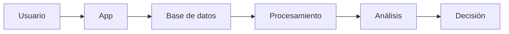

# Práctica RA5 · a+b — Datos e información

## 1) Caso
- Sistema: Plataforma de streaming (tipo Netflix)
- Contexto: La plataforma recopila datos de los usuarios para recomendar contenido y mejorar su servicio.

## 2) Datos
- Nombre del usuario
- Edad
- Series vistas
- Tiempo de visualización
- Valoración (likes/dislikes)
- Dispositivo usado

## 3) Información
- Series más populares
- Géneros preferidos por grupo de edad
- Horas pico de uso

## 4) Diferencia
- Dato: Información sin procesar (ej: “usuario vio 3 series”)
- Información: Resultado del análisis de datos (ej: “las series de acción son las más vistas por jóvenes”)

## 5) Ciclo del dato
- Captura: El usuario navega y ve contenido en la app
- Almacenamiento: Los datos se guardan en servidores o bases de datos
- Procesamiento: Se organizan y agrupan los datos
- Análisis: Se detectan patrones (gustos, hábitos)
- Uso: Se generan recomendaciones personalizadas
- Eliminación o archivo: Se eliminan datos antiguos o se almacenan de forma histórica

## 6) Aplicación
- Decisiones
    - Recomendar series o películas
    - Crear contenido basado en tendencias
    - Ajustar precios o planes
- Si solo hay datos sin procesar
    - No se pueden sacar conclusiones
    - No hay mejoras en el servicio
    - No se toman decisiones útiles
- Valor
    - Mejora la experiencia del usuario
    - Aumenta el tiempo de uso
    - Incrementa beneficios de la empresa

## 7) Tabla

| Dato                  | Información                        |
| --------------------- | ---------------------------------- |
| Usuario ve serie A    | Serie A es popular                 |
| Edad: 20 años         | Jóvenes prefieren acción           |
| 3 horas de uso diario | Alta actividad en usuarios jóvenes |
| Valoración positiva   | Contenido bien recibido            |
| Uso en móvil          | Mayoría usa dispositivos móviles   |

## 8) Diagrama

## 9) Problemas

- Problema 1: Datos incorrectos (edad falsa)
- Solución 1: Validación de datos al registrarse
- Problema 2: Datos incompletos
- Solución 2: Solicitar información obligatoria y limpiar datos

## 10) Fuente
- Enlace:
