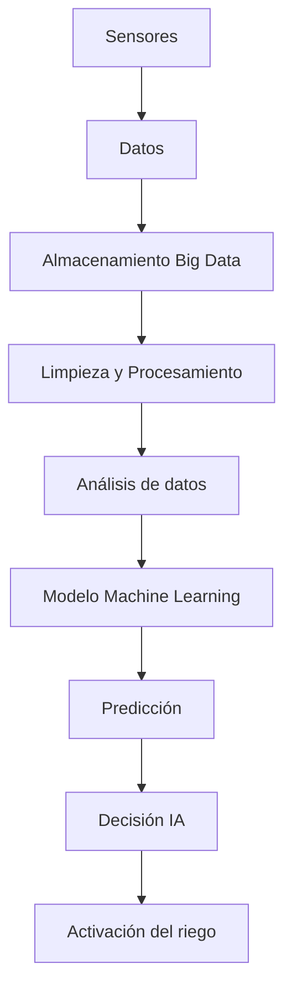

# Práctica RA5 · c+d — Big Data e IA

## 1) Caso
- **Sistema:** Sistema inteligente de riego agrícola
- **Contexto:** Una explotación agrícola quiere optimizar el uso de agua y mejorar la producción utilizando datos de sensores y predicciones automáticas.

## 2) Conceptos
- **Big Data:** Gran volumen de datos recogidos por sensores (humedad del suelo, temperatura, clima, consumo de agua).
- **Análisis de datos:** Estudio de los datos para detectar cuándo y cuánto regar.
- **Machine Learning:** Modelos que aprenden patrones para predecir las necesidades de riego según condiciones ambientales.
- **Deep Learning:** Uso de redes neuronales para analizar múltiples variables complejas como clima, tipo de cultivo y suelo.
- **IA:** Sistema que automatiza la decisión de cuándo activar el riego.

## 3) Relación
Big Data recoge datos del campo → el análisis los interpreta → Machine Learning predice necesidades → Deep Learning mejora precisión → la IA ejecuta decisiones automáticas.

## 4) Pipeline
1. Recogida de datos (sensores, clima, suelo)  
2. Almacenamiento en sistemas Big Data  
3. Limpieza de datos  
4. Análisis de patrones  
5. Entrenamiento del modelo  
6. Predicción de necesidades de riego  
7. Activación automática del sistema 

## 5) 5V del Big Data
- **Volumen:** Datos continuos de múltiples sensores.
- **Velocidad:** Datos en tiempo real.
- **Variedad:** Datos de clima, suelo, agua y cultivos.
- **Veracidad:** Precisión de los sensores.
- **Valor:** Ahorro de agua y mejora de la producción.

## 6) Ejemplo aplicado
- **Datos:** Humedad del suelo y temperatura.
- **Análisis:** Identificación de sequedad en el terreno.
- **Modelo:** Predicción del momento óptimo de riego.
- **Decisión:** Activar automáticamente el sistema de riego.

## 7) Tabla

| Concepto          | Función                                     |
|------------------|----------------------------------------------|
| Big Data         | Recoger y almacenar datos del entorno        |
| Análisis de datos| Interpretar condiciones del cultivo          |
| Machine Learning | Predecir necesidades de riego                |
| Deep Learning    | Analizar múltiples variables complejas       |
| IA               | Automatizar decisiones del sistema           |

## 8) Diagrama

## 9) Problemas
- Problema 1:
- Solución 1:
- Problema 2:
- Solución 2:

## 10) Fuente
- Enlace:
